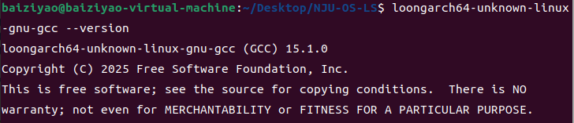

#NJU-OS
NJU-OS是南京大学的一个教学操作系统，现有x86版本。
LoongArch是由我国龙芯中科研发的自主指令系统（龙芯架构）。
本项目基于xv6-loongarch将NJU-OS移植到LoongArch平台上，在Ubuntu 20.04中通过QEMU模拟器（在PC上模拟LoongArch硬件）编译NJU-OS并运行，完成NJU-OS的三个实验（跳过实验一）。

#配置编译环境
本实验所用的交叉编译工具链为：
https://github.com/loongson/build-tools/releases/download/2025.08.08/x86_64-cross-tools-loongarch64-binutils_2.45-gcc_15.1.0-glibc_2.42.tar.xz
下载后通过共享文件夹到Ubuntu
设置路径：
```sh
export PATH="{/path/to/cross-tools}/bin:$PATH"
```
上述的命令只是临时设置环境变量，如需永久设置，可通过修改/etc/profile实现； 
```sh
loongarch64-unknown-linux-gnu-gcc --version
```
看到如下提示则说明已正确设置

