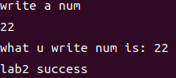

# 实验目的
1. 实现一个简单的应用程序，并在其中调用两个自定义实现的系统调用。
2. 了解基于中断实现系统调用的全过程。
# 实验内容
1. 内核初始化  
2. 内核态向用户态的跳转（原实验为：Bootloader 从实模式进入保护模式，加载内核至内存，并跳转执行，内核内核加载用户程序至内存，对内核堆栈进行设置，通过 iret 切换至用户空间，执行用户程序。）  
3. 用户程序调用自定义实现的库函数 scanf 完成格式化输入和 printf 完成格式化输出。  
4. scanf 基于中断陷入内核，内核扫描按键状态获取输入完成格式化输入（现阶段不需要考虑键盘中断）。  
5. printf 基于中断陷入内核，由内核完成在视频映射的显存地址中写入内容，完成字符串的打印。
# 实验过程
1. 内核初始化
   ```bash
   kinit();
   vminit();
   tarpinit();
   apic_init();
   extioi_init();
   binit();
   userinit();
   ```
# QEMU运行lab2
```bash
cd qemu-loongarch-runenv
```  
通过脚本文件`./run_loongarch.sh`的-k参数，指定我们编译好的lab2内核，即可启动仿真运行  
```bash
./run_loongarch.sh -k ../kernel/kernel
```
输入一个数字看到如下提示则说明实验完成  

