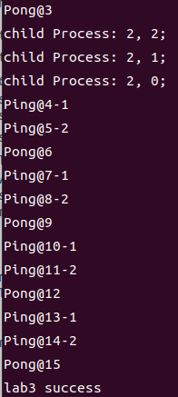

# 实验目的
1. 实现一个简单的任务调度。
2. 介绍基于时间中断进行进程切换以及纯用户态的非抢占式的线程切换完成任务调度的全过程。
# 实验内容
1. 内核：实现进程切换机制，并提供系统调用 fork、sleep、exit。
2. 库：对上述系统调用进行封装；实现一个用户态的线程库，完成 pthread_create、pthread_join、pthread_yield、pthread_exit 等接口。
3. 用户：对上述库函数进行测试。  
# QEMU运行lab3
```bash
cd qemu-loongarch-runenv
```  
通过脚本文件`./run_loongarch.sh`的-k参数，指定我们编译好的lab3内核，即可启动仿真运行  
```bash
./run_loongarch.sh -k ../kernel/kernel
```
看到如下部分输出说明实验成功！   

